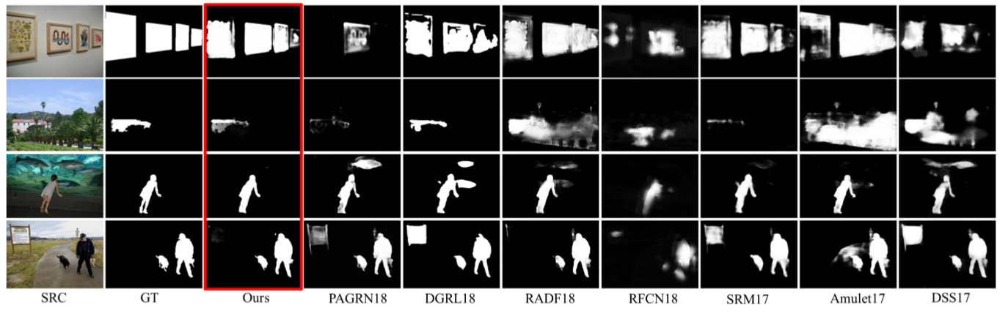

# Recursive Multi-model Deep Fusion for Robust Salient Object Detection

## abstract
Fully convolutional networks have shown outstanding performance in the image salient object detection field. The current main stream methods have a tendency to become deeper and more complicate, which easily homogenizes its deep features reaching the performance bottleneck. In sharp contrast to the conventional “deeper” strategy, we propose to design “wider” network architecture via constructing a novel parallel sub network framework to further improve the detection performance. To pursuit the feature diversity, our sub networks are designed with different network architectures, and we enforce each sub network to focus on different saliency perspectives via using independent saliency loss. Meanwhile, to handle the feature conflictions raised in parallel sub networks, we construct dense short-connections to enable a recursively interaction between sub networks, ensuring an optimalcomplementary status between multi-model deep features. Finally, all these complementary multi-model deep features are selectively fused to produce high quality saliency maps. Also, we have compared our method with 16 state-of-the-art methods over 8 datasets to demonstrate the superiority of our method. The source code and data is also public available Saliency maps of the paper " Multi-model Deep Fusion for Salient Object Detection ",can download at google dirve .

### Visual comparison with previous start-of-the-arts

## Usage
Please install Caffe first. I think you may find a great number of tutorials talking about how to install it

	
	git clone https://github.com/Diamond101010/MMDF.git
	
Before you start, you also need our pretrained model.
 Then run
 
	 cd examles
	 python demo.py

##Download

We provide the results online datasets including  [DUT-OMRON](https://drive.google.com/open?id=1hq6w_LhvMblyYdLFFskLtR77wm4NDFFm), [DUTS-TE](https://drive.google.com/open?id=1LYsFtnCOGiCSL4nyyD9UWw1T0gBo-34F), [ECSSD](https://drive.google.com/open?id=1QHkds8ZMAB_YdJZ8WaOb-mFQnHDa55Un), [HKU-IS](https://drive.google.com/open?id=1ApPVWLRDJDsT0iM54jZyevkErqcVPJSy), [MSRA10K](https://drive.google.com/open?id=1-u1KEfbYWXrJ1Ku1bgW8dZ1i2FnwjGiX),[PASCAL-S](https://drive.google.com/open?id=1jMuhfouo3sFXcDYHZtt8S7iWanUv4ftE), [SED2](https://drive.google.com/open?id=1PwyQvGqaeMKrz91JomZ-0OGQUgOV2XAN), [SOD](https://drive.google.com/open?id=1dwwZ-bxrUAYI0Q7q2Q8SXKP0WFYn25cf)

## 

