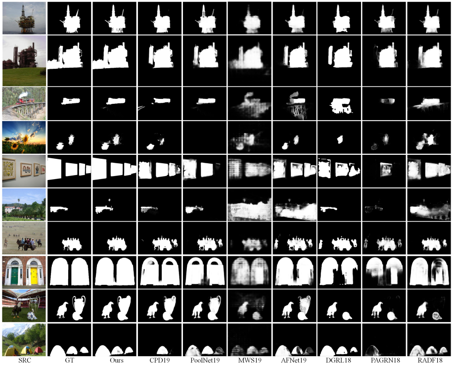

# Recursive Multi-model Deep Fusion for Robust Salient Object Detection

## Abstract
Fully convolutional networks have shown outstanding performance in the image salient object detection field. The current main stream methods have a tendency to become deeper and more complex, which easily homogenize its learned deep features, reaching the performance bottleneck. In sharp contrast to the conventional “deeper” schemes, we propose a “wider” network architecture by constructing a novel framework with parallel sub networks to further improve the detection performance. We enforce each sub network (with total different network architectures) to focus on different saliency perspectives via using independent saliency loss to ensure a large feature diversity. Meanwhile, to handle the feature confliction problem, which is occasionally occurred in the parallel networks, we construct dense short-connections to enable a recursively interaction between our parallel sub networks, pursuing an optimal complementary status between multi-model deep features. All these complementary multi-model deep features will be selectively fused to make high performance saliency predictions.
### Visual comparison with previous start-of-the-arts

## Usage
Please install Caffe first. I think you may find a great number of tutorials talking about how to install it

	
	git clone https://github.com/Diamond101010/MMDF.git
	
Before you start, you also need our pretrained model.
 Then run
 
	 cd examles
	 python demo.py

## Download

We provide the results online datasets including  [DUT-OMRON](https://drive.google.com/open?id=1hq6w_LhvMblyYdLFFskLtR77wm4NDFFm), [DUTS-TE](https://drive.google.com/open?id=1LYsFtnCOGiCSL4nyyD9UWw1T0gBo-34F), [ECSSD](https://drive.google.com/open?id=1QHkds8ZMAB_YdJZ8WaOb-mFQnHDa55Un), [HKU-IS](https://drive.google.com/open?id=1ApPVWLRDJDsT0iM54jZyevkErqcVPJSy), [MSRA10K](https://drive.google.com/open?id=1-u1KEfbYWXrJ1Ku1bgW8dZ1i2FnwjGiX),[PASCAL-S](https://drive.google.com/open?id=1jMuhfouo3sFXcDYHZtt8S7iWanUv4ftE), [SED2](https://drive.google.com/open?id=1PwyQvGqaeMKrz91JomZ-0OGQUgOV2XAN), [SOD](https://drive.google.com/open?id=1dwwZ-bxrUAYI0Q7q2Q8SXKP0WFYn25cf)

## 

